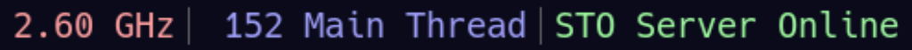

# STO Server Status (for integration with status bars on Linux) 

A command line utility that simply reports whether or not the Star Trek Online game server is down for maintenance or not, by querying the same API that the game's launcher does. Intended for integration with a status bar like i3blocks or i3status, so you can keep track of when the servers come back online, or if they're currently down for maintenance.

This utility, despite performing HTTP requests and handling GZip encoded JSON as a response, has **zero** dependencies. Not. One. Crate.

The only dependency is something that every Linux installation should have already: `libz` which this utility includes bindings to in order to inflate the GZip response. No JSON parser is needed as of yet (although I intend on writing a basic parser anyway in order to see the latest news updates/weekend events, and because it's fun), since the only thing needed from the response is a single, uniquely identifiable substring that can easily be obtained with basic string searching and extraction logic.

Why not just use serde and reqwest? Partly to prove the point that sometimes people are too quick to add dependencies that ultimately bloat the binary and slow compile times, when the functionality needed from the dependency is such a small piece of the dependency as a whole, and that the complexity of that piece is often overestimated; it's not hard to open a TCP socket, send an HTTP request, invoke GZip, sanitize some JSON and look for a substring. Is it really worth adding serde and reqwest just for one tiny operation? 

Also because it's fun. 

No documentation necessary; it literally just outputs "STO Server Online" or "STO Server Offline" to stdout when run. That's it.

